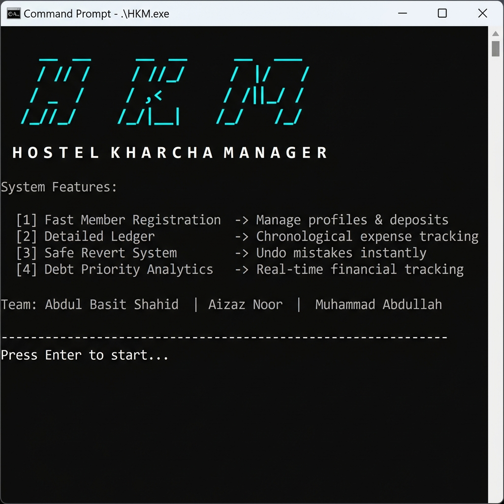
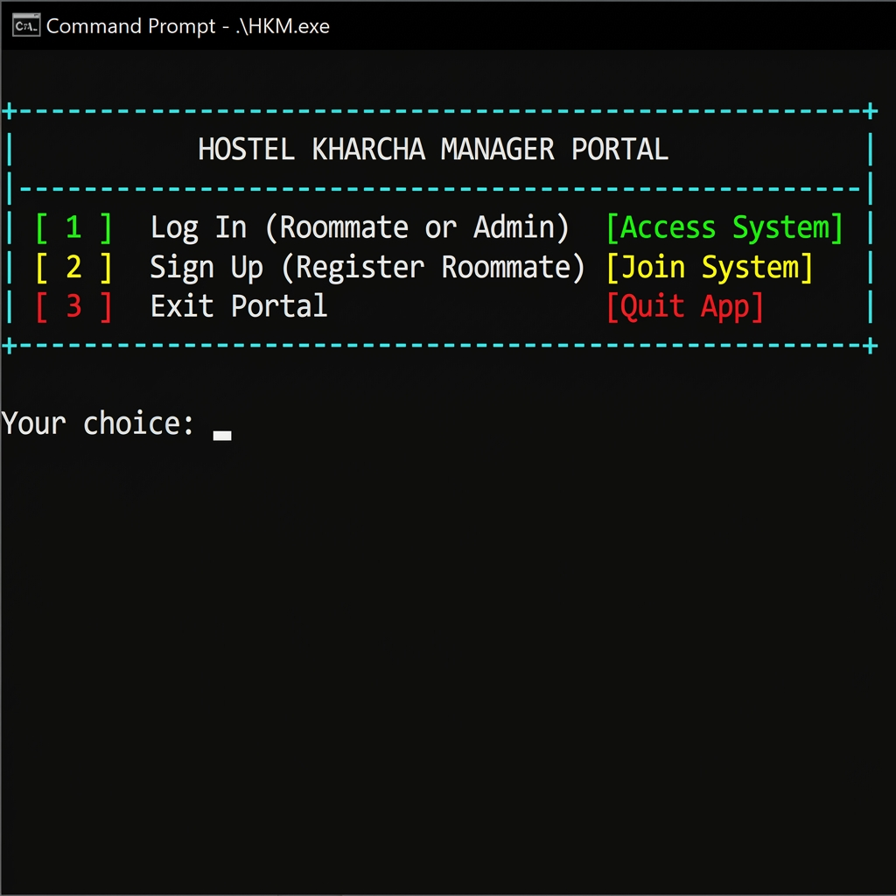
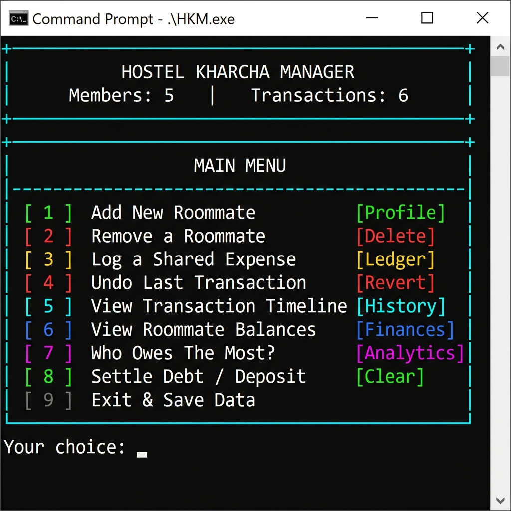
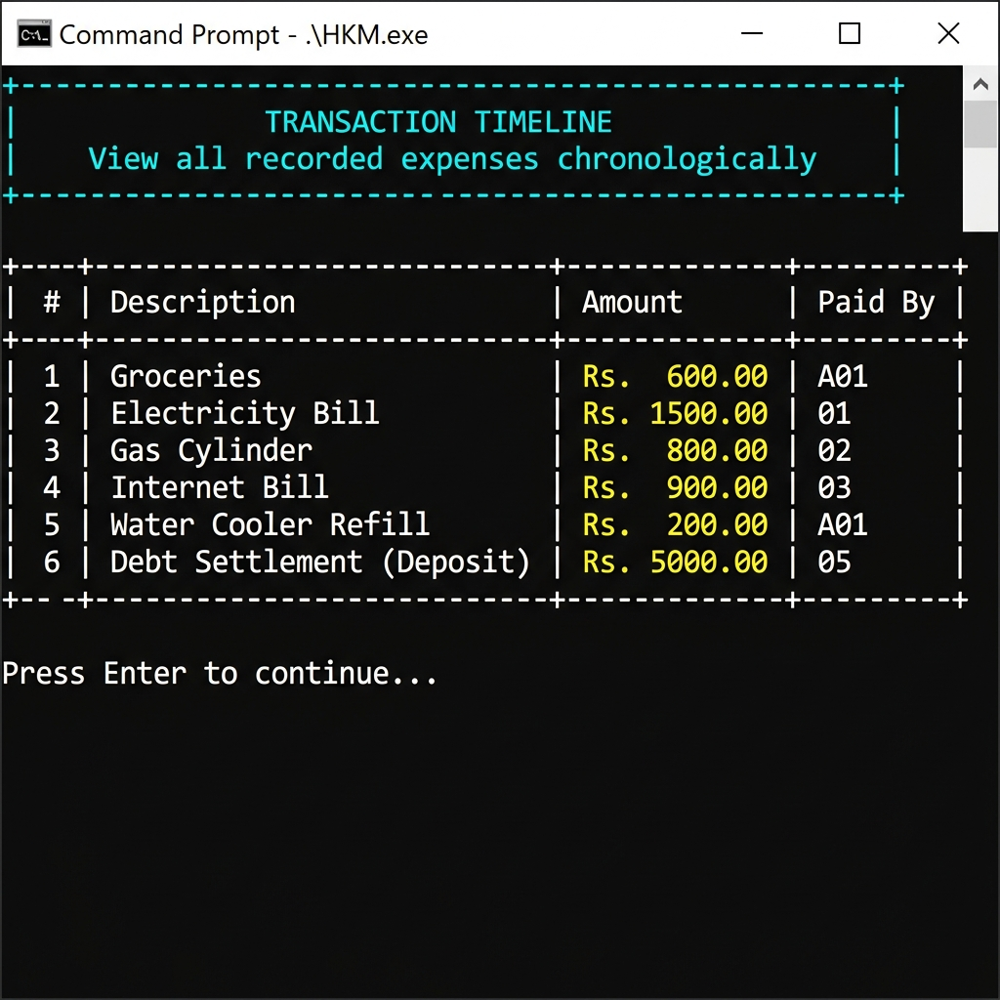
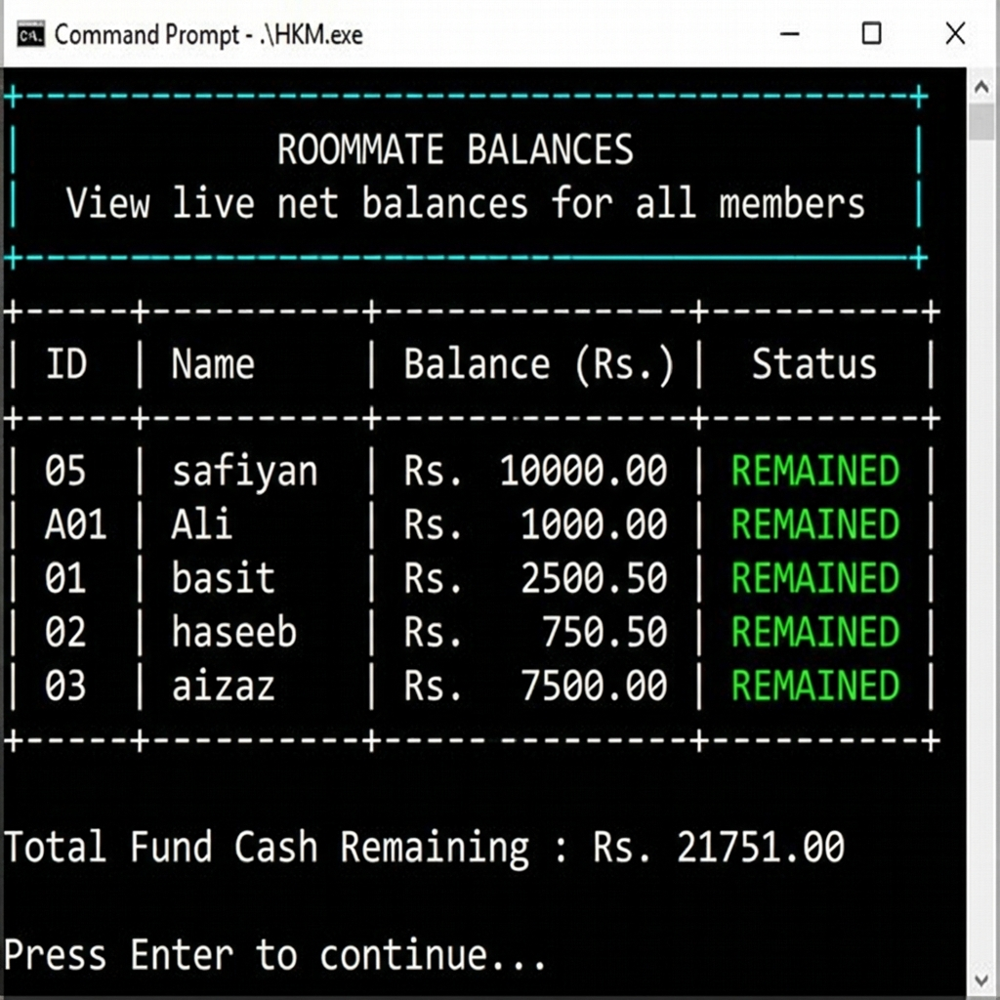
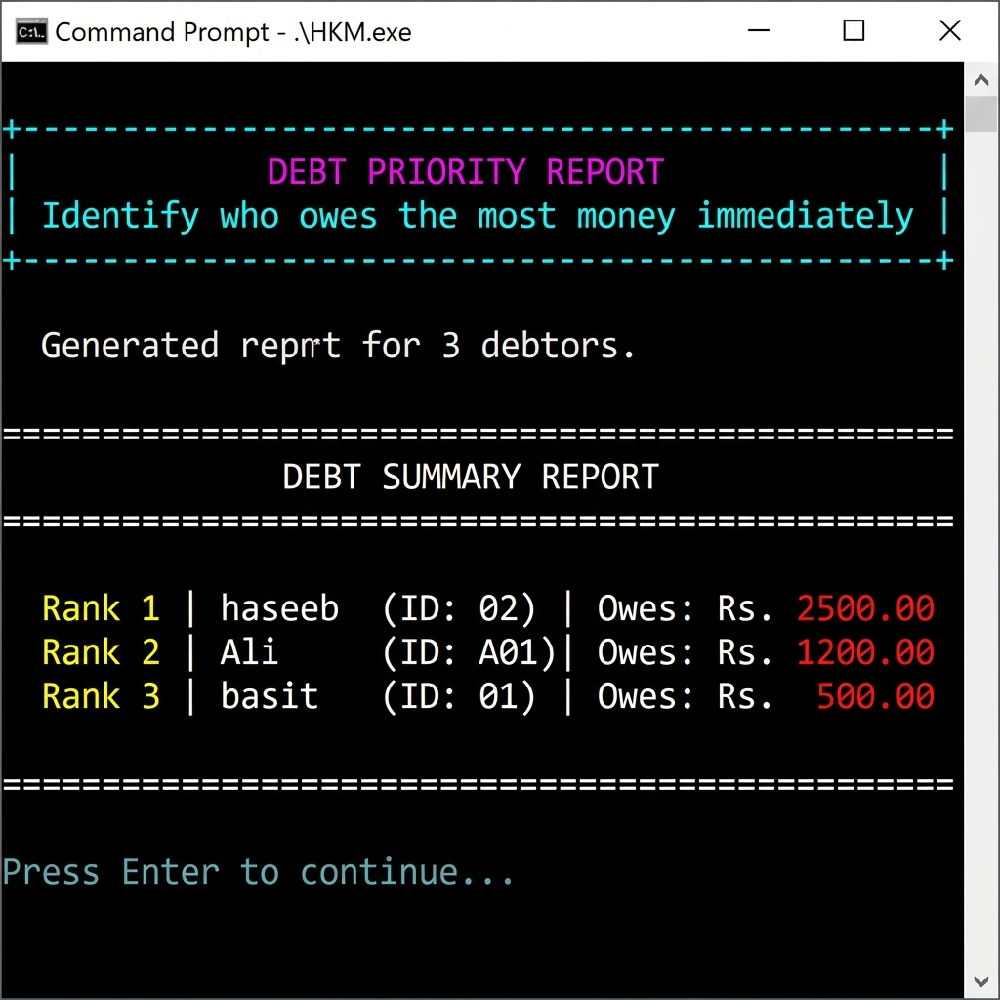

# Hostel Kharcha Manager

A C++ terminal application for tracking shared expenses in a hostel. Six roommates, one electricity bill, zero arguments about who paid that's what this solves.

Built as a 3rd semester Data Structures project. Every data structure is written from scratch. No STL containers, no external libraries.

---

## The Problem

When multiple people share a space, tracking who paid what becomes a daily headache. Manual notes get lost. WhatsApp messages get buried. Someone always forgets they owe money.

This app keeps a running ledger of every shared expense, splits costs automatically, and lets you undo a transaction if someone made a mistake all from the terminal.

---

## Features

- **Member registration** with ID, name, and password
- **Admin and roommate login** with separate access levels
- **Log shared expenses** and split them equally or by custom weight
- **Undo any transaction** reverses the expense and restores all balances
- **Transaction timeline** a chronological list of every expense
- **Live balance view** for all members
- **Debt report** shows who owes the most, ranked by amount
- **Debt settlement** deposit or withdraw money directly
- **Remove a roommate** handles outstanding balances before deletion
- **Data persistence** saves to CSV on exit, reloads on next run

---

## Screenshots

**Splash screen on launch**


**Login / Sign Up portal**


**Main menu showing 5 members and 6 transactions loaded from file**


**Transaction timeline full expense history**


**Roommate balances live net balance for each member**


**Debt priority report max-heap puts the highest debtor at the top**


---

## Data Structures Used

| Structure | Where |
|---|---|
| Hash Map (separate chaining) | Member storage and O(1) lookup by ID |
| Doubly Linked List | Transaction history insert at tail, traverse both ways |
| Stack (linked list) | Undo engine last expense is first to revert |
| Max-Heap (array) | Debt analytics member with highest debt at the root |

Each structure is in its own `.h` / `.cpp` pair under `include/` and `src/`.

---

## How the Undo Works

Every time an expense is logged, the transaction node gets appended to the tail of the doubly linked list. At the same time, a pointer to that node is pushed onto the undo stack.

When undo is called:
1. Pop the top of the stack this gives the exact node to remove
2. Reverse every balance change stored inside that node
3. Unlink the node from the DLL using its own `prev` and `next` pointers no search needed

Removal is O(1) because the DLL node already knows its neighbors. This is the key advantage over a singly linked list or an array.

---

## Project Structure

```
DSA project/
├── include/
│   ├── MemberHash.h
│   ├── TransactionTimeline.h
│   └── DebtHeap.h
├── src/
│   ├── main.cpp
│   ├── MemberHash.cpp
│   ├── TransactionTimeline.cpp
│   └── DebtHeap.cpp
├── members.csv          (auto-generated on first run)
├── transactions.csv     (auto-generated on first run)
└── HKM.exe
```

---

## Build & Run

Requires g++ (MinGW on Windows).

```bash
g++ -o HKM.exe src/main.cpp src/TransactionTimeline.cpp src/MemberHash.cpp src/DebtHeap.cpp -I include
.\HKM.exe
```

Default admin login: `admin` / `admin123`

---

## Quick Demo

```
1. Sign up two roommates (A01, A02)
2. Log in as admin
3. Log an expense: Groceries, Rs. 600, paid by A01, equal split
4. View timeline — both entries appear
5. View balances — A01 is owed Rs. 300, A02 owes Rs. 300
6. Undo last transaction — balances go back to zero
7. View timeline — expense is gone
```

---

## Team

| Member | Role |
|---|---|
| Abdul Basit Shahid | Hash Map member registration and balance tracking |
| Aizaz Noor | Doubly Linked List + Stack transaction history and undo engine |
| Muhammad Abdullah | Max-Heap debt priority analytics and reporting |

---

## Language

C++ compiled with g++ on Windows. Uses `<windows.h>` for ANSI color support in the terminal.
